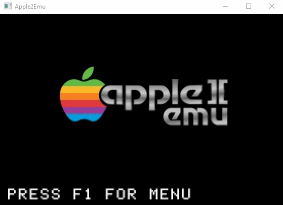
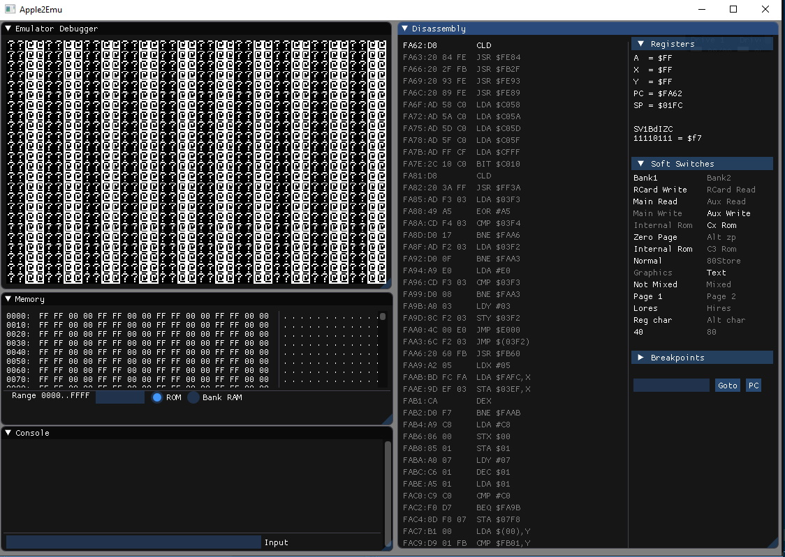

# Apple2Emu - An Apple ][ Emulator

Apple2Emu is an Apple ][ emulator.  Having started programming on the Apple ][ in the early 80's, I have always wanted to write an emulator for that system.  One goal for this emulator is to be cross platform (Windows, Mac OS, and Linux).  Given modern hardware, the need to write obfustaced code for the sake of speed is really not an issue anymore, so a second goal is to provide readable code that is more easily understood by someone looking to see how emulators can be built.  



# Required Libraries
The following external libraries are currently required to build apple2emu.
* [SDL 2.X](https://www.libsdl.org/) - For cross platform graphics, key, gamepad, handling
* [SDL Image 2.X](https://www.libsdl.org/projects/SDL_image/) - For loading texture images for fonts
* [ImGUI](https://github.com/ocornut/imgui) - currently included in apple2emu repo. Used for ingame menus. 
* [NativeFileDialog](https://github.com/mlabbe/nativefiledialog) - currently included in apple2emu repo.  Used for file selection dialogs
* [Glew](http://glew.sourceforge.net/) - GL Extension wrangler library.  Needed to provide runtime glue for application to host GL function calls.
* [Z80emu](https://github.com/anotherlin/z80emu) - Z80 emulation layer (for CP/M support).  This code is also included in apple2emu.

## Building the emulator
There are two ways to build the editor:  cmake and Visual Studio 2015 (not generated by cmake).  I use VS 2015 for my main development and have kept the VS solution up to date.  I have also added cmake support (which can also generate VS solutions).  So for windows, either method will work, although it's probably easier for windows users to use the provided solution.

### Windows
Open the apple2emu.sln in Visual Studio 2015.  Before the solution can actually be built, some changes will likey need to be made in the proejct settings in order to properly find include file paths and library paths.  To change the paths:

1. Right click on the apple2emu project and select "properties"
2. Select the C/C++ item in the properties tree
3. In the "Additional Include Directories" edit box, choose "edit" from the dropdown
4. Modify the SDL2, SDL2 image, and GLEW paths depending on where you have installed the required libraries
5. Click OK.
6. Select the "Linker" options in the properties tree
7. In the "Additional Library Direcgtories" edit box, choose "edit" from the dropdown
8. Modify the SDL2, SDL2_image, and GLEW paths to where those libraries are installed
9. Click OK on all dialogs to save the settings

At this point, hitting F7 should build the project.

### CMake
To build with Cmake, please do the following:

1. At your machines command line, change to the apple2emu directory
2. type 'mkdir build'
3. type 'cd build'
4. type 'cmake ..'
5. type 'make' (if you generated a makefile.  Note that cmake can build visual studio solutions and if you used cmake to build a visual studio solution, then open the solution with Visual studio and hit F7)

These steps should build the emulator as an executable named 'apple2emu' (or apple2emu.exe on windows). Note that a cmake build will copy provided disk and rom images into the build folder (along with required dlls).  

Cmake will attempt to find the required libraries: SDL2, SDL2_Image, Glew, and ncurses (for non windows machines).  If cmake cannot find any of these required libraries, an error will be produced in which case some hints may need to be given to cmake to find these libraries.

* To help cmake find your SDL2 installation, you can set the environment variable **SDL2** to point to the top level folder where SDL2 is located
* To help cmake find your SDL2_image installation, you can set the environment variable **SDL2_IMAGE** to point to the top level folder where SDL2_image is located
* If GLEW cannot be found you can add the following on the cmake command line:
  * ```cmake .. -DGLEW_INCLUDE_DIR=<path_to_GLEW_include> -DGLEW_LIBRARY=<path_to_glew32s.lib_file>```
  * For example:  ```cmake .. -DGLEW_INCLUDE_DIR=c:\projects\glew-1.13.0\include -DGLEW_LIBRARY=c:\projects\glew-1.13.0\lib\Release\Win32\glew32s.lib```

## Running the emulator
Run the emulator (either type apple2emu from the command line or hit F5 in visual studio).  You will be shown a splash screen and instructions to hit F1 to open the menu.  Hit F1 to bring up the menubar where you can set various options.  Specifcally, you will want to choose the emulation type and the disk to load in drive 1 (and possibly drive 2).  The F1 menu can also be used to control other features of the emulator such as emulator speed and color.

You will need to find disk images online that you can use in the emulator.  There are currently some great sources for images online:

* [Asimov] (ftp://ftp.apple.asimov.net/pub/apple_II/)
* [Apple 2 Online](http://apple2online.com/index.php?p=1_23_Software-Library)

Use the Disk menu to mount a disk into a disk drive and then you can boot the machine.  The emulation speed slider can be used to control how quickly the emulator operates.  

## Integrated 6502 Debugger

There is an integrated 6502 debugger in apple2emu.  Press F11 from within the emulator to start up the debugger.  The debugger can be opened from the splash screen or anytime that the emulator is running.  This screenshot shows the debugger after pressing F11 from the splash screen.



The upper left corner shows the apple ][ screen.  The lower left corner is a memory viewer.  On the upper right is the disassembly of the machine broken on the assembly line when you entered the debugger.  And the lower right contains the console window where you can type commands.  There are two other "windows" which are rolled up.  The are sandwiched between the screen view and the memory view.  These are the soft switch status and breakpoint windows.  Double clicking on these windows will unroll those windows to their full size.

Apple2emu uses imgui for all of the debugger interface.  This fact means that these windows can be moved, collapsed and resized.  Those changes should be saved and restored everytime you close and reopen Apple2emu.  Find a window layout that you like and it will stay that way.

When focus is in the disassembly view, the following keys can be used:

* F5 - continue execution (withing the debugger).  This key will start execution of the emulator (until a breakpoint is hit)
* F6 - Step over current instruction.  If the current line is a JSR, then this command will step over the JSR continuing to the next line of code
* F7 - Step into current instruction.  Basically the opposite of F6 as it will step into a subroutine.
* F9 - Toggle breakpoint on the current line.  Breakpoints will be highlighted in red (and can be seen in the breakpoints window).

In addition, commands can be typed in the console window:
* 'step' to single step when broken
* 'continue' to continue execution
* 'break'  to set read/write breakpoint on memory location
* 'enable'/'disable' to enable or disable break or watchpoints
* 'list' to list breakpoints
* 'delete' to delete break or watch points
* 'trace' to start a trace dump to file (could create metric ton of output)
* 'quit' quits the debugger and hides the debugger windows
* 'exit' exits the emulator


## License
Apple2Emu is covered under the MIT license.  A copy of this license is available in the same directory as this file under the name License.txt  

